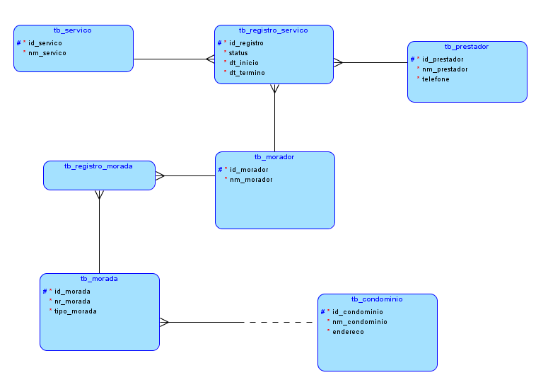

<h1>FIAP Fase 1 : Capítulo 4 </h1>

<h3>Início</h3>

Para abstrair o conhecimento adquirido no capítulo 4 da Fase 1 desenvolvi o seguinte modelo de negócios:

Temos moradores que ocupam um determinado condomínio. Estes podem está procurando serviços domésticos de diversos tipos (elétrico, hidráulico ou mecânico) e o prestador de serviço detém a capacitação. 

A ideia é criar uma aplicação que facilite o encontro entre moradores e prestadores de serviço.

Segue abaixo a representação gráfica do modelo relacional.



<h3>Setup</h3>

<ul>
    <li>Cria o arquivo maven java</li>
    <li>Configura o arquivo pom.xml da seguinte forma:</li>
</ul>

````xml
<project xmlns="http://maven.apache.org/POM/4.0.0" xmlns:xsi="http://www.w3.org/2001/XMLSchema-instance" xsi:schemaLocation="http://maven.apache.org/POM/4.0.0 https://maven.apache.org/xsd/maven-4.0.0.xsd">
  <modelVersion>4.0.0</modelVersion>
  <groupId>br.com.encontro</groupId>
  <artifactId>encontro</artifactId>
  <version>0.0.1</version>
  <dependencies>
  
  	<dependency>
  		<groupId>org.hibernate</groupId>
  		<artifactId>hibernate-core</artifactId>
  		<version>RELEASE</version>
  	</dependency>
  	
  	<dependency>
  		<groupId>oracle</groupId>
  		<artifactId>jdbc-driver</artifactId>
  		<version>12</version>
  		<scope>system</scope>
  		<systemPath>C:/Users/lucca/Oracle/ojdbc8.jar</systemPath>
  	</dependency>
  
  </dependencies>
  
  
</project>
````

<ul>
    <li>Converte o arquivo para JPA</li>
    <li>Configura o arquivo persistence.xml inicialmente da seguinte forma:</li>
</ul>

````xml
<?xml version="1.0" encoding="UTF-8"?>
<persistence version="2.1" xmlns="http://xmlns.jcp.org/xml/ns/persistence" xmlns:xsi="http://www.w3.org/2001/XMLSchema-instance" xsi:schemaLocation="http://xmlns.jcp.org/xml/ns/persistence http://xmlns.jcp.org/xml/ns/persistence/persistence_2_1.xsd">
	<persistence-unit name="encontro" transaction-type="RESOURCE_LOCAL">
	
		<provider>
			org.hibernate.jpa.HibernatePersistenceProvider
		</provider>
		
		<properties>
			<property name="hibernate.show_sql" value="true" />
			<property name="hibernate.format_sql" value="true" />
			<property name="hibernate.hbm2ddl.auto" value="create" />
			<property name="hibernate.dialect" value="org.hibernate.dialect.Oracle12cDialect" />
			<property name="javax.persistence.jdbc.driver" value="oracle.jdbc.OracleDriver" />
			<property name="javax.persistence.jdbc.url" value="jdbc:oracle:thin:@oracle.fiap.com.br:1521:ORCL" />
			<property name="javax.persistence.jdbc.user" value="XXXXX" />
			<property name="javax.persistence.jdbc.password" value="XXXXX" />
		</properties>
	
	</persistence-unit>
</persistence>
````

Feita a configuração inicial


<hr>
<h3>Criação das entidades</h3>

1. <b>Condominio.java</b>

   ````java
   package br.com.encontro.entity;
   
   import javax.persistence.Column;
   import javax.persistence.Entity;
   import javax.persistence.GeneratedValue;
   import javax.persistence.GenerationType;
   import javax.persistence.Id;
   import javax.persistence.SequenceGenerator;
   import javax.persistence.Table;
   
   @Entity
   @Table(name="tb_condominio")
   public class Condominio {
   
   	@Id
   	@SequenceGenerator(name="condominio",sequenceName="sq_tb_condominio",allocationSize=1)
   	@GeneratedValue(strategy=GenerationType.SEQUENCE, generator="condominio")
   	@Column(name="id_condominio")
   	private int id;
   	
   	
   	@Column(name="nm_condominio",nullable=false,length=100)
   	private String nome;
   	
   	
   	@Column(name="endereco",nullable=false,length=200)
   	private String endereco;
   
   	public Condominio() {
   	}
   
   	public Condominio(String nome, String endereco) {
   		this.nome = nome;
   		this.endereco = endereco;
   	}
   
   	public int getId() {
   		return id;
   	}
   
   	public void setId(int id) {
   		this.id = id;
   	}
   
   	public String getNome() {
   		return nome;
   	}
   
   	public void setNome(String nome) {
   		this.nome = nome;
   	}
   
   	public String getEndereco() {
   		return endereco;
   	}
   
   	public void setEndereco(String endereco) {
   		this.endereco = endereco;
   	}
   	
   }
   ````

   Após criada a classe incluir a seguinte linha em `persistence.xml`

   ````xml
   <class>br.com.encontro.entity.Condominio</class>
   ````

2. <b>Morador.java</b>

   ````java
   package br.com.encontro.entity;
   
   import javax.persistence.Column;
   import javax.persistence.Entity;
   import javax.persistence.GeneratedValue;
   import javax.persistence.GenerationType;
   import javax.persistence.Id;
   import javax.persistence.SequenceGenerator;
   import javax.persistence.Table;
   
   @Entity
   @Table(name="tb_morador")
   public class Morador {
   
   	@Id
   	@SequenceGenerator(name="morador",sequenceName="sq_tb_morador",allocationSize=1)
   	@GeneratedValue(strategy=GenerationType.SEQUENCE, generator="morador")
   	@Column(name="id_morador")
   	private int id;
   	
   	@Column(name="nm_morador",nullable=false,length=100)
   	private String nome;
   	
   	@Column(name="nr_morador",nullable=false)
   	private Long telefone;
   	
   	public Morador() {
   	}
   
   	public Morador(String nome, Long telefone) {
   		this.nome = nome;
   		this.telefone = telefone;
   	}
   
   	public int getId() {
   		return id;
   	}
   
   	public void setId(int id) {
   		this.id = id;
   	}
   
   	public String getNome() {
   		return nome;
   	}
   
   	public void setNome(String nome) {
   		this.nome = nome;
   	}
   
   	public Long getTelefone() {
   		return telefone;
   	}
   
   	public void setTelefone(Long telefone) {
   		this.telefone = telefone;
   	}
   	
   }
   
   ````

   Após criada a classe incluir a seguinte linha em `persistence.xml`

   ````xml
   <class>br.com.encontro.entity.Morador</class>
   ````

3. <b>Prestador.java</b>

   ````java
   package br.com.encontro.entity;
   
   import javax.persistence.Column;
   import javax.persistence.Entity;
   import javax.persistence.GeneratedValue;
   import javax.persistence.GenerationType;
   import javax.persistence.Id;
   import javax.persistence.SequenceGenerator;
   import javax.persistence.Table;
   
   @Entity
   @Table(name="tb_prestador")
   public class Prestador {
   	
   	@Id
   	@SequenceGenerator(name="prestador",sequenceName="sq_tb_prestador",allocationSize=1)
   	@GeneratedValue(strategy=GenerationType.SEQUENCE, generator="prestador")
   	@Column(name="id_prestador")
   	private int id;
   	
   	@Column(name="nm_prestador",nullable=false,length=100)
   	private String nome;
   	
   	@Column(name="nr_morador",nullable=false)
   	private Long telefone;
   	
   	public Prestador() {
   	}
   
   	public Prestador(String nome, Long telefone) {
   		this.nome = nome;
   		this.telefone = telefone;
   	}
   
   	public int getId() {
   		return id;
   	}
   
   	public void setId(int id) {
   		this.id = id;
   	}
   
   	public String getNome() {
   		return nome;
   	}
   
   	public void setNome(String nome) {
   		this.nome = nome;
   	}
   
   	public Long getTelefone() {
   		return telefone;
   	}
   
   	public void setTelefone(Long telefone) {
   		this.telefone = telefone;
   	}
   	
   	
   	
   
   }
   
   ````

   Após criada a classe incluir a seguinte linha em `persistence.xml`

   ````xml
   <class>br.com.encontro.entity.Prestador</class>
   ````

4. <b>Servico.java</b>

   Antes de criar a classe, precisamos criar o enum `Ocupacao.java`

   ````java
   package br.com.encontro.entity;
   
   public enum Ocupacao {
   
   	PINTOR, ELETRICISTA, PEDREIRO, ENCANADOR
   	
   }
   
   ````

    Após criado o enum, iniciamos a criação da classe

   ````java
   package br.com.encontro.entity;
   
   import javax.persistence.Column;
   import javax.persistence.Entity;
   import javax.persistence.EnumType;
   import javax.persistence.Enumerated;
   import javax.persistence.GeneratedValue;
   import javax.persistence.GenerationType;
   import javax.persistence.Id;
   import javax.persistence.SequenceGenerator;
   import javax.persistence.Table;
   
   @Entity
   @Table(name="tb_servico")
   public class Servico {
   
   	@Id
   	@SequenceGenerator(name="servico",sequenceName="sq_tb_servico",allocationSize=1)
   	@GeneratedValue(strategy=GenerationType.SEQUENCE, generator="servico")
   	@Column(name="id_servico")
   	private int id;
   	
   	@Enumerated(EnumType.STRING)
   	@Column(name="nm_servico")
   	private Ocupacao nome;
   	
   	public Servico() {
   	}
   
   	public Servico(Ocupacao nome) {
   		this.nome = nome;
   	}
   
   	public int getId() {
   		return id;
   	}
   
   	public void setId(int id) {
   		this.id = id;
   	}
   
   	public Ocupacao getNome() {
   		return nome;
   	}
   
   	public void setNome(Ocupacao nome) {
   		this.nome = nome;
   	}
   	
   	
   	
   }
   
   ````

5. 

